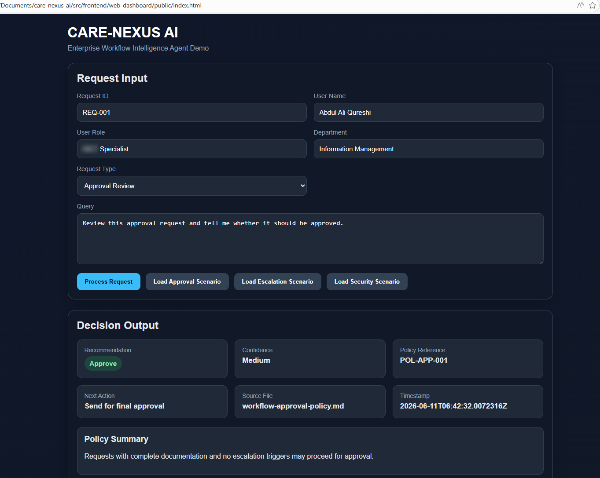
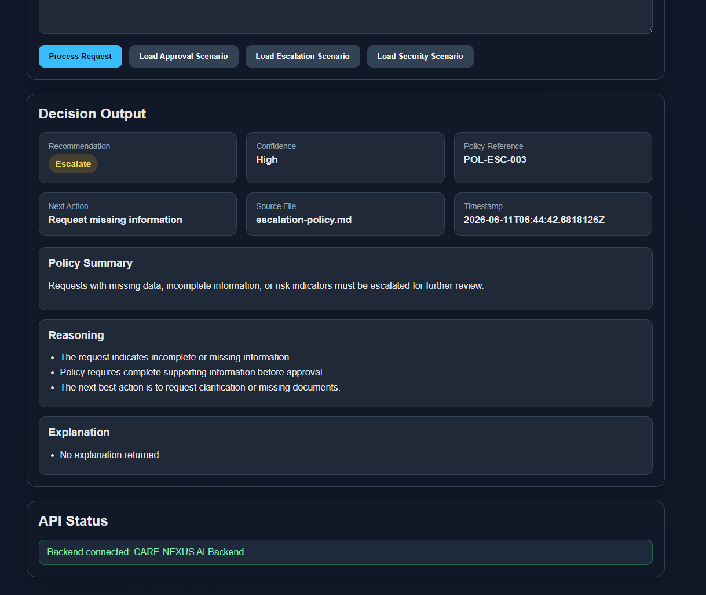

# CARE-NEXUS AI
Enterprise Workflow Intelligence Agent  

🚀 Overview
CARE‑NEXUS AI is a multi‑agent enterprise workflow intelligence assistant designed for healthcare environments. 
It enables users to evaluate workflow requests, retrieve policies from SharePoint, and generate explainable, 
policy‑grounded decisions through an intuitive dashboard.

The solution demonstrates how enterprise AI agents can integrate with Microsoft Graph and enterprise knowledge systems to deliver:

✅ Context‑aware workflow evaluation

✅ Policy‑grounded decision-making

✅ Explainable AI outputs with citations

✅ Intelligent automation for healthcare IT workflows

🎯 Problem Statement
Healthcare IT environments  face major operational challenges:

Fragmented workflows across systems (EHR, SharePoint, email)
Heavy administrative burden (approvals, documentation, validation)
Delays due to manual coordination and review cycles
Lack of traceability and consistency in decision-making

Many workflows depend on:

Policy documents stored in SharePoint
Manual interpretation of rules
Multi-step approval processes

💡 Solution
CARE‑NEXUS AI addresses these challenges by combining:

Context Understanding → identifies workflow type and request intent
Knowledge Retrieval → fetches policies from SharePoint using Microsoft Graph
Reasoning Engine → evaluates requests against policy conditions
Explainability Layer → provides traceable decisions with citation and evidence

🧠 Microsoft Foundry IQ used; can be easily integrated with **Work IQ and Fabric IQ**
CARE‑NEXUS AI is designed to align with Microsoft IQ layers:

✅ **Foundry IQ (Primary)**

Retrieves enterprise knowledge from SharePoint via Graph API
Grounds responses in policy documents
Provides citation and evidence to prevent hallucination

✅ Work IQ (Conceptual Alignment)

Uses user context (role, department, request type)
Mimics Copilot-style contextual understanding

✅ Fabric IQ (Conceptual Alignment)

Applies structured reasoning over workflow rules
Translates business policies into decision logic

🏗️ Architecture

High-Level Flow

User → UI Dashboard

     → Agent Orchestrator
     
     → Work Context Service
     
     → Knowledge Service (SharePoint)
     
     → Reasoning Service
     
     → Decision Output
     

**Components**

🔗 SharePoint Integration (**Foundry IQ**)
The system integrates with SharePoint using the Microsoft Graph API:

Authenticates using Azure AD (Client Credentials Flow)
Retrieves policy documents from document libraries
Parses content for decision-making
Provides citation and evidence in output

Example APIs used:
GET /sites/{hostname}:/{relative-path}
GET /sites/{site-id}/drives
GET /drives/{drive-id}/root/children
GET /drives/{drive-id}/items/{item-id}/content

⚙️ Technology Stack
Backend

.NET (ASP.NET Core Web API)
Microsoft.Graph (via REST)
Microsoft.Identity.Client (MSAL)
C#

Frontend

HTML / CSS / JavaScript
Responsive dashboard UI

Integration

SharePoint Online
Microsoft Graph API
Azure AD (App Registration)

📂 Project Structure

✅ Features

✅ Workflow decision evaluation
✅ SharePoint policy retrieval
✅ Explainable AI (reasoning + explanation)
✅ Citation & evidence outputs
✅ Scenario simulation (Approval, Escalation, Security)
✅ Modern UI dashboard

🧪 Demo Scenarios
🟢 Approval

Input: Standard request
Output: ✅ Approved
Based on policy match

🟡 Escalation

Input: Missing information
Output: ⚠️ Escalate
Based on incomplete criteria

🔴 Security Review

Input: Sensitive request
Output: 🚩 Security routing
Based on risk indicators

📊 Example Output
Recommendation: Approve
Confidence: Medium
Policy Reference: SP-DOC
Next Action: Send for final approval

Citation:
SharePoint Document: workflow-policy.md

Explanation:
- Based on policy evaluation
- No risk indicators found

🔐 Security & Compliance

Uses Azure AD authentication
Secure API communication
Supports role-based filtering
Provides audit-friendly outputs

🚧 Limitations

Uses simplified policy parsing (text-based)
Binary files (PDF/DOCX) require an additional parsing layer
Permission model simulated for demo

🔮 Future Enhancements

✅ Azure Cognitive Search integration
✅ Semantic / vector search
✅ Power Automate integration (Action Agent)
✅ **Role-based access control from Graph**
✅ Teams / Copilot integration

🏆 Innovation Highlights

✅ Real enterprise data integration (SharePoint)
✅ Foundry IQ-aligned knowledge retrieval
✅ Explainable AI decisions
✅ Healthcare workflow relevance
✅ End-to-end functional system

🎯 Summary
CARE‑NEXUS AI demonstrates how enterprise AI agents can:

Connect to SharePoint
Retrieve policy knowledge securely
Reason over workflow requests
Deliver explainable, auditable decisions

👉 Enabling faster, safer, and more transparent operations in healthcare IT environments.

👨‍💻 Author
Abdul Ali Qureshi
Healthcare IT | AI | Workflow Automation

---

## 🧪 Demo

### 📸 Screenshots

#### Approval Scenario

#### Escalation Scenario

#### Security Scenario

#### Care-Nexus-AI-Demo Screen Shot Docx

---

